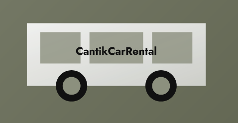
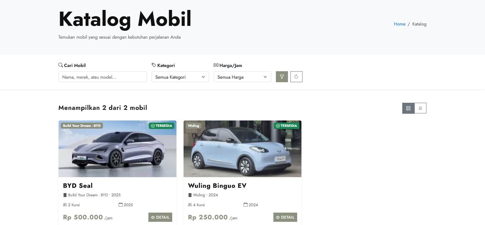
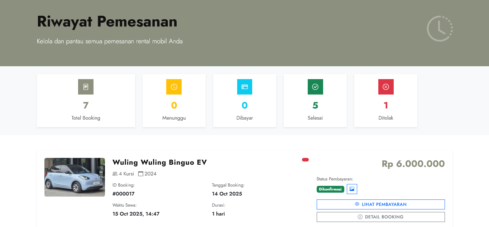
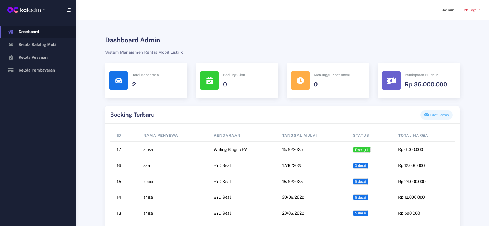
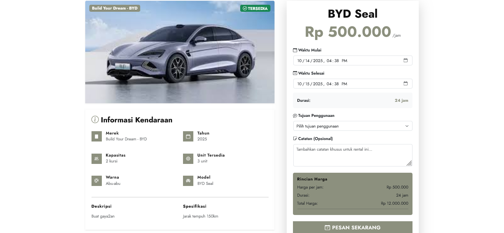

# CantikCarRental

> A modern web application designed to simplify the process of renting cars — fast, secure, and user-friendly! 

---


## Features
- User-Friendly Interface — Makes it easy for users to search and rent cars  
- Authentication System — Secure login and registration  
- Real-Time Booking — Displays car availability instantly  
- Data Management — CRUD functionality for cars and users (admin panel)  
- Responsive Design — Fully optimized for desktop and mobile devices
---

## Tech Stack
- Framework: Laravel Framework 10.48.29  
- Database: MySQL  
- Tools: Laragon, Git, GitHub, Visual Studio Code  
---

## 🛠️ Installation
```bash
# Clone the repository
git clone https://github.com/ansmlptr/Web-Peminjaman-Mobil.git

# Go to the project directory
cd Web-Peminjaman-Mobil

# Install dependencies
composer install
npm install && npm run dev

# Copy file environment
cp .env.example .env

# Generate application key
php artisan key:generate

# Run database migrations
php artisan migrate

# Start the local development server
php artisan serve
```
---

## Website Pages
| Page                    | Screenshot |
| ----------------------  |  ---------- |
| **Car Catalog**      |   |
| **History**          |   |
| **Admin Dashboard**  |  |
| **Booking Page**     |  |
---

## Developer
- **Name**: Anisa Amalia Putri
- **Email**: [ansmlptr03@gmail.com](mailto:ansmlptr03@gmail.com)
